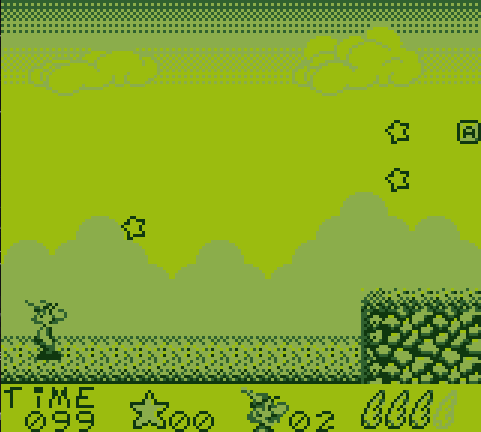

TS-GB
===

[](https://travis-ci.org/Lyrkan/ts-gb)

TypeScript Game Boy emulator (WIP)



# How to use it

You can either directly use the embedded electron app or (relatively)
easily implement your own thing on top of the classes provided by `ts-gb`.

## Running the embedded electron app

```
$ git clone git@github.com:lyrkan/ts-gb.git
$ cd ts-gb
$ yarn
$ yarn start
```

## Doing it manually

```
$ yarn add ts-gb
```


```ts
import { System } from 'ts-gb/system';

// Initializing a System instance that holds
// all the necessary components. You can also
// initialize each one of them manually if you
// want to.
const sytem = new System();

// Loading an optional bootrom
system.loadBootRom(arrayBuffer);

// Loading a game
system.loadGame(arrayBuffer);

// If you decide to change ROMs after
// initializing everything don't forget
// to reset all the components (CPU,
// memory, display, DMA handler)
system.reset();
```

Once that's done you'll have to handle the following things:

* When a button is pressed you'll have to call `system.joypad.down(button)`
  followed by `system.joypad.up(button)` when it is released
* The `system.tick()` method will have to be called at a
  frequency of 1MHz.

You'll then be able to call `system.display.getFrontBuffer()` everytime
you want to refresh your screen (the closer from 59.7 FPS the
better).

If you want to see how that can be done take a look at the
[TS-GB Web](https://github.com/Lyrkan/ts-gb-web) implementation.
